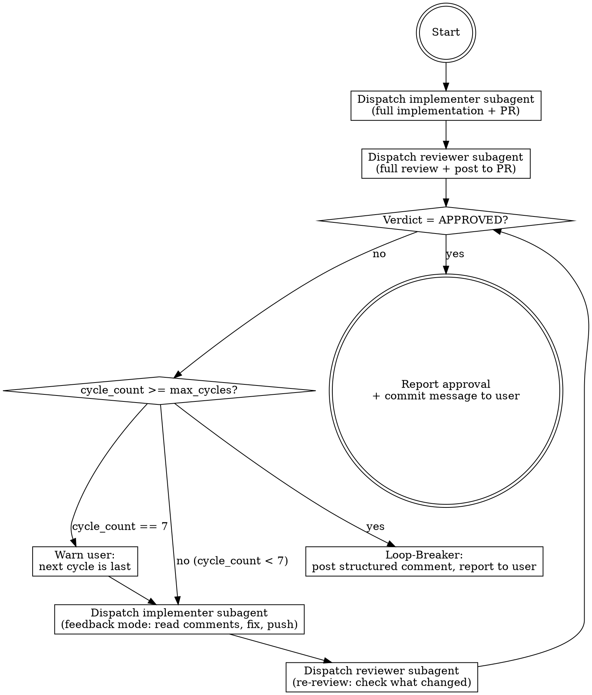

# Sprint Implement-Review Loop

Orchestrates the full implement → review → fix → re-review cycle for a sprint. Runs up to 8 cycles before handing back to the human.

**Architecture:** The orchestrator (you) is a lightweight controller that dispatches subagents via the `Agent` tool. The implementer subagent follows inline instructions; the reviewer subagent invokes the `sprintkit-review` skill via the `Skill` tool. You stay small, retain full loop awareness, and each subagent gets fresh context for its specific job.

## Orchestrator Responsibilities

You handle ONLY:
- Loop state tracking (cycle count, PR number, verdict, unresolved issues)
- Dispatching implementer subagent with focused prompt
- Reading subagent results and extracting key info (PR number, status)
- Dispatching reviewer subagent with focused prompt
- Checking verdict via `gh pr view`
- Deciding: loop again, break, or report approval
- Communicating with the user

You do NOT:
- Read PRD or sprint plan yourself (subagents do that)
- Write or review code (subagents do that)
- Post review comments (subagents do that)

## Track Resolution

Before starting, determine which PRD/sprint track to work on.

1. **If invoked with a track argument** (e.g., `args: "track:foo"`), resolve paths directly:
   - `default` → `docs/prd.md` + `docs/sprint.md`
   - `<name>` → `docs/<name>-prd.md` + `docs/<name>-sprint.md`
   Skip to using these paths.

2. **Otherwise**, scan the `docs/` directory for PRD files (`*-prd.md` and `prd.md`) and sprint files (`*-sprint.md` and `sprint.md`). Group into tracks by matching prefixes.

3. Select the track:
   - **One track exists**: use it, mention which one.
   - **Multiple tracks exist**: list them and ask the user which one.
   - **No tracks exist**: tell the user and suggest `/sprintkit-prd`.

Once resolved, inject the literal resolved paths into all subagent prompts. Use **PRD file** and **Sprint file** for all subsequent references.

### Base branch pass-through

Callers may also pass a `base:<branch>` token in `args` (e.g., `args: "track:foo base:epic/foo"`). This is what the autopilot's "epic mode" uses to redirect sprint PRs at a long-lived epic branch instead of `main`.

If `base:` is present, save it as `base_branch` and forward it verbatim into the implementer subagent's prompt as `base:<branch>` so `sprintkit-implement` opens the PR with `--base <branch>`. If absent, `base_branch` is `main` and you can omit it (sprintkit-implement defaults to `main`).

This skill itself doesn't act on the base branch — it never runs `git` or `gh pr create` directly. The pass-through exists solely so the implementer subagent receives the right `--base` target.

### Sprint selection

Callers may pass a `sprint:<N>` token in `args` (e.g., `args: "sprint:7 track:foo"`). Resolve which sprint to work in this order:

1. **`sprint:<N>` in `args`** — use it. This is authoritative and needs no confirmation.
2. **Exactly one sprint marked `[IN PROGRESS]`** — use it.
3. **More than one `[IN PROGRESS]`** — do not guess. Under `sprintkit-autopilot`'s scheduler, several sprints run concurrently in separate worktrees and each marks its own claim, so the marker alone no longer identifies *your* sprint. Report `BLOCKED` asking for an explicit `sprint:<N>`.

Forward the resolved sprint number into every subagent prompt so the implementer and reviewer work the same sprint.

**When running inside a parallel runner**, other worktrees are editing other parts of the repo at the same time. Confine changes to the files this sprint owns, and never edit the Sprint file — the controller and `sprintkit-sync` own it.

## State Tracking

Track these variables throughout the loop:
- `sprint_number` — which sprint is being worked
- `pr_number` — GitHub PR number (set after Cycle 1)
- `cycle_count` — current cycle (starts at 1)
- `max_cycles` — 8 (hard limit)
- `cycle_limit_warning_emitted` — whether the cycle-7 warning fired; reported in the closing summary
- `last_verdict` — `APPROVED`, `CHANGES_REQUESTED`, or `REVIEW_REQUIRED`
- `unresolved_summary` — brief summary extracted from reviewer result
- `implementer_agent_id` — agent ID for potential resume
- `reviewer_agent_id` — agent ID for potential resume
- `track_name` — resolved track name ("default" or the slug)
- `prd_file` — resolved PRD path
- `sprint_file` — resolved sprint path
- `base_branch` — resolved base branch for sprint PRs (defaults to `main`; epic mode passes `epic/<track>`)

---

## Loop Flow



---

## Cycle 1: Full Implementation

### Step 1: Dispatch Implementer Subagent

Use the `Agent` tool with `subagent_type: "general-purpose"`:

```
description: "Sprint N: implement stories"
prompt: |
  You are a senior software engineer implementing Sprint <sprint_number>.

  ## Your Task
  Follow the sprintkit-implement workflow:
  1. Read <prd_file> and <sprint_file>
  2. Identify Sprint <sprint_number> and read all its stories and acceptance criteria
  3. If anything is ambiguous or unclear, ask questions before proceeding
  4. Implement all stories in dependency order, writing tests first
  5. Run the test suite and formatter — fix any failures
  6. Commit, push to a new branch off `<base_branch>`, and open a GitHub PR
     with `gh pr create --base <base_branch>`. The base branch is critical:
     pass it to sprintkit-implement in args so the PR targets the right branch.

  When invoking sprintkit-implement (via Skill tool or by following its
  workflow inline), include `base:<base_branch>` in args alongside
  `track:<track_name>`.

  PR title format: [Sprint <sprint_number>] <sprint goal>

  ## When Running Bash Commands
  Make individual, single-purpose tool calls — never bundle multiple commands into one bash block.

  ## Report Back
  When done, report:
  - **PR number** (critical — the orchestrator needs this)
  - **Branch name**
  - **Stories implemented** (list with acceptance criteria status)
  - **Any concerns or deferred items**
  - **Status:** DONE | DONE_WITH_CONCERNS | BLOCKED | NEEDS_CONTEXT

  If you have questions, ask them — don't guess.
```

Save the returned `agent_id` as `implementer_agent_id`.

### Step 2: Extract Results

From the implementer's result, extract:
- `pr_number` — the PR number it opened
- Implementation status
- Any concerns

Set `cycle_count = 1`.

### Step 3: Dispatch Reviewer Subagent

Use the `Agent` tool with `subagent_type: "general-purpose"`:

```
description: "Sprint N: review PR"
prompt: |
  Review PR #<pr_number> for Sprint <sprint_number>.

  Invoke the sprintkit-review skill using the Skill tool:
    skill: "sprintkit-review"
    args: "track:<track_name>"

  The skill handles everything: reading the PRD, sprint plan, PR diff,
  writing the structured review report, and posting it to the PR.

  ## Report Back
  When done, report:
  - **Verdict:** APPROVED | CHANGES_REQUESTED | COMMENTED
  - **Blocker count** and brief list
  - **Non-blocker count** and brief list
  - **Summary** (2-3 sentences)
```

Save the returned `agent_id` as `reviewer_agent_id`.

---

## Verdict Detection

After each reviewer subagent returns, check the PR verdict using ONLY `gh pr view`:

```bash
gh pr view <pr_number> --json reviewDecision,latestReviews
```

- `reviewDecision = "APPROVED"` → exit loop (approved)
- `reviewDecision = "CHANGES_REQUESTED"` → continue loop
- `reviewDecision = "REVIEW_REQUIRED"` or empty → run the **self-approval marker check** below; otherwise continue loop

**IMPORTANT: Do NOT fall back to parsing the reviewer's text output for keywords like "APPROVED" or "Ready to merge."** The `gh pr view` reviewDecision is the only authoritative source. If the reviewer subagent says "approved" in its text but posted a `--comment` or `--request-changes` review, the PR is NOT approved. Text-based fallback matching has caused false approvals in the past. The only permitted exception is the exact, structured marker described below — it is a narrow, orchestrator-internal contract with `sprintkit-review`, not free-text matching.

Both `CHANGES_REQUESTED` and `COMMENTED` verdicts trigger another cycle unless the self-approval marker check below confirms approval. Even "minor fixes" should be cleaned up before merge.

### Self-approval marker check (empty `reviewDecision` only)

GitHub blocks `--approve` when the PR author and reviewer are the same account, so a genuinely clean review from `sprintkit-review` on a self-authored PR lands as `COMMENTED` with `reviewDecision = ""`. To distinguish this from a "continue looping" state, run this check — and only this check — when `reviewDecision` is empty:

```bash
PR_AUTHOR=$(gh pr view <pr_number> --json author --jq .author.login)
ME=$(gh api user --jq .login)
gh pr view <pr_number> --json reviews --jq '.reviews[-1] | {author: .author.login, state, body}'
```

Treat the PR as **approved** if and only if ALL of the following are true:

1. `PR_AUTHOR == ME` — the PR is self-authored (same GitHub account that is authenticated to `gh`).
2. The latest review's `author.login == ME` — the latest review was posted by the same account.
3. The latest review's `state == "COMMENTED"` — never `CHANGES_REQUESTED`.
4. The latest review's `body` contains the exact marker string:
   ```
   <!-- sprintkit-review-verdict: READY_TO_MERGE; reason: self-approval-blocked -->
   ```

Any other combination → fall through and continue the loop as before. The marker alone is insufficient; all four gates must hold.

This marker is the **only** permitted text-based signal in the loop. It exists because `sprintkit-review` emits it exclusively on the "Ready to merge" path, where `--approve` was blocked by GitHub's self-review rule. Do not broaden this check to any other string or any other review state.

---

## Cycles 2–8: Feedback Mode

**From cycle 3 onward, only blockers already named in cycle 2 may block.** A
blocker *class* appearing for the first time at cycle 3 or later is a plan
finding by definition — route it to the sprint file's Non-blocking Review Backlog
and let the verdict stand on the named blockers alone. The exception is a defect
the previous cycle's fixes themselves introduced: a regression in code just
pushed is in scope at any cycle.

This is the convergence rule, and it is what should end the loop — not the cycle
cap. Without it a thorough reviewer keeps finding real things indefinitely, each
fix moves the surface, and the loop diverges rather than closing. The cap at
`max_cycles` is only a backstop for when something has gone wrong enough that a
human is genuinely needed; a loop that routinely reaches it is failing this rule,
not the limit.

Increment `cycle_count`. Before dispatching the implementer for the final cycle — i.e., when 7 cycles have completed without approval (`cycle_count == 7`) — warn the user:

> "We're about to start cycle 8 of 8 — the final cycle. If the reviewer doesn't approve after this cycle, I'll hand back to you with a summary of unresolved issues."

Also set `cycle_limit_warning_emitted = true`. If you are running inside a `sprintkit-autopilot` runner subagent, that message reaches no user — the flag is how it survives, via the structured summary at the end, for the controller to relay.

### Step 1: Dispatch Implementer Subagent (Feedback Mode)

Use the `Agent` tool with `subagent_type: "general-purpose"`:

```
description: "Sprint N: address review feedback"
prompt: |
  You are a senior software engineer addressing code review feedback on PR #<pr_number>
  for Sprint <sprint_number>.

  ## Your Task
  1. Read the PR review comments: `gh pr view <pr_number> --json comments,reviews`
  2. Read the latest review to understand what issues were flagged
  3. For each flagged issue, either:
     - Fix it in code, or
     - Reply on the PR explaining why you disagree (use `gh pr comment`)
  4. Run the test suite and formatter — fix any failures
  5. Commit and push your fixes
  6. Post a top-level PR comment summarizing what was changed and what was
     intentionally left as-is (with reasons)

  ## Context from Previous Cycles
  <unresolved_summary>

  ## When Running Bash Commands
  Make individual, single-purpose tool calls — never bundle multiple commands into one bash block.

  ## Report Back
  When done, report:
  - **What was fixed** (list of addressed issues)
  - **What was intentionally left as-is** (with reasons)
  - **Any new concerns**
  - **Status:** DONE | DONE_WITH_CONCERNS | BLOCKED | NEEDS_CONTEXT

  If you have questions, ask them — don't guess.
```

### Step 2: Dispatch Reviewer Subagent (Re-Review Mode)

Use the `Agent` tool with `subagent_type: "general-purpose"`:

```
description: "Sprint N: re-review PR"
prompt: |
  Re-review PR #<pr_number> for Sprint <sprint_number> after the implementer
  addressed feedback.

  Invoke the sprintkit-review skill using the Skill tool:
    skill: "sprintkit-review"
    args: "re-review pr:<pr_number> track:<track_name>"

  The skill's re-review mode handles checking new commits, verifying
  previously flagged issues were addressed, and posting an updated review.

  ## Previously Flagged Issues
  <unresolved_summary>

  ## Report Back
  When done, report:
  - **Verdict:** APPROVED | CHANGES_REQUESTED
  - **Resolved issues** (list)
  - **Still unresolved** (list, if any)
  - **New issues found** (list, if any)
  - **Summary** (2-3 sentences)
```

### Step 3: Check Verdict and Update State

Update `unresolved_summary` from the reviewer's result. Check verdict and decide: loop again or exit.

---

## Handling Subagent Questions

Subagents may ask clarifying questions instead of completing their task. When a subagent's result contains questions (status `NEEDS_CONTEXT` or questions in the output):

1. Surface the questions to the user
2. Wait for the user's answers
3. Resume the subagent using the `Agent` tool's `resume` parameter with the saved `agent_id`, passing the user's answers in the prompt

---

## Extracting Info from Subagent Results

Subagent results are unstructured text. Look for these patterns:

- **PR number**: Look for `#123`, `PR number: 123`, or URLs containing `/pull/123`
- **Verdict**: Look for `APPROVED`, `CHANGES_REQUESTED`, `COMMENTED`
- **Status**: Look for `DONE`, `DONE_WITH_CONCERNS`, `BLOCKED`, `NEEDS_CONTEXT`
- **Issues**: Look for bulleted lists under headings like "Blockers", "Issues", "Unresolved"

If the subagent's result is ambiguous, use `gh pr view` to get authoritative state.

---

## Loop-Breaker (after Cycle 8, no approval)

Do NOT dispatch another implementer subagent. Instead:

1. Post a structured PR comment:

```bash
gh pr comment <pr_number> --body "$(cat <<'EOF'
## Human Review Required

This PR has gone through 8 implementation-review cycles without approval. Here's the current state:

### Unresolved Issues
<list from unresolved_summary tracking>

### Recurring Patterns
<issues that appeared in multiple cycles>

### Questions for Human
<any points where reviewer and implementer disagreed, or where the right answer is unclear>

### Suggested Next Steps
- [ ] Review the unresolved issues above
- [ ] Decide which items need implementation changes vs. acceptance criteria clarification
- [ ] Resume with /sprintkit-implement when ready to continue
EOF
)"
```

2. Report to the user in conversation:

> "The sprint loop has reached its 8-cycle limit without approval. I've posted a structured summary to PR #<pr_number> with the unresolved issues, recurring patterns, and questions that need human judgment.
>
> Next steps:
> - Review PR #<pr_number> for the full breakdown
> - Decide on the open questions
> - When ready, invoke /sprintkit-implement to continue (it will pick up from the PR comments)"

---

## Completion: Approval

When `reviewDecision = "APPROVED"` — or when the self-approval marker check above confirmed approval on a self-authored PR — extract the recommended merge commit message from the reviewer's review body, then tell the user:

> "PR #<pr_number> has been approved after <cycle_count> cycle(s). Recommended merge commit message:
>
> ```
> <recommended commit message from reviewer>
> ```
>
> Merging is left to you."

If approval was derived from the self-approval marker, append a one-line note to the message so the user understands why `gh pr view reviewDecision` is empty:

> "Approval derived from the sprintkit-review self-approval marker — GitHub blocked `--approve` because the PR author and reviewer are the same account."

### Always close with the structured summary

Whatever the outcome — approval, cycle limit, blocked — end with these lines verbatim. When this skill runs inside a `sprintkit-autopilot` runner subagent there is no human reading the prose above; these lines are what the controller parses to decide whether to merge.

```
- **Sprint:** Sprint <N> — <name>
- **PR number:** #<pr> | none
- **Cycles used:** <n> of 8
- **Cycle-limit warning reached:** yes | no
- **Unresolved issues:** <short list> | none
- **Status:** APPROVED | BLOCKED | NEEDS_CONTEXT | CYCLE_LIMIT
```

`Cycle-limit warning reached` must be `yes` if the cycle-7 warning fired at any point. Inside a runner that warning reaches no one, so the controller re-emits it to the user on your behalf — but only if you report it.

---

## Key Commands Reference

```bash
# Check verdict
gh pr view <pr_number> --json reviewDecision,latestReviews

# Read PR comments for feedback mode
gh pr view <pr_number> --json comments,reviews,commits

# Post loop-breaker comment
gh pr comment <pr_number> --body "<structured summary>"
```

---

## What This Skill Does NOT Do

- Does not skip the implementer's clarifying question phase (Cycle 1)
- Does not merge — merging is always left to the human
- Does not run more than 8 cycles
- Does not implement stories itself — subagents do that
- Does not review code itself — reviewer subagents invoke the `sprintkit-review` skill for that
- Does not read PRD or sprint plans — subagents do that
- Does not paste full sprint plans into subagent prompts (subagents read them with fresh context)
