# Sprint graph

**Source:** `docs/sprint.md`  
**Sprints:** 53 total · 0 done · 53 remaining  
**Runners simulated:** 4  
**File-scope rule:** enforced (Touches declared)

## Dependency graph

Orange outline is the critical path — the longest chain, which sets the floor on wall-clock no matter how many runners you add.

```mermaid
graph TD
  subgraph M0_foundation["M0 foundation"]
    S1["1 · Scaffold and a running dev server"]
  end
  subgraph M0_fan["M0 fan"]
    S2["2 · ESLint 9, type-aware"]
    S3["3 · The frozen contract"]
    S4["4 · The CI gate"]
    S5["5 · Design tokens, both fonts and t…"]
    S6["6 · Playwright under the base path"]
    S7["7 · Boundary and purity lint"]
    S8["8 · Vitest coverage hardening"]
    S9["9 · The stub engine and the fixture…"]
    S13["13 · EngineContext, the VITE_E2E sea…"]
  end
  subgraph Track_A_logic["Track A (logic)"]
    S10["10 · The fold harness"]
    S14["14 · mulberry32 with externalised state"]
    S15["15 · Grammar core and the 240-string…"]
    S16["16 · parseOrder and the round-trip"]
    S17["17 · Scoring"]
    S18["18 · Queue, arrivals and the shift ramp"]
    S19["19 · Generator"]
    S21["21 · The engine reducer"]
    S22["22 · Ruling matrix and coverage"]
  end
  subgraph M3_slack_fill["M3 (slack-fill)"]
    S11["11 · Storage: versioned localStorage"]
    S12["12 · Title screen"]
    S20["20 · daily.ts"]
    S32["32 · How to Play: the grammar reference"]
  end
  subgraph Track_B_presentation["Track B (presentation)"]
    S23["23 · Slot selector rows"]
    S24["24 · Slot rows: keyboard and a11y"]
    S25["25 · The vessels: bag then cup"]
    S26["26 · Liquid colour model"]
    S27["27 · Peng: ice and condensation"]
    S28["28 · The cup↔bag transition"]
    S29["29 · Queue cards: structure and orde…"]
    S30["30 · Queue cards: patience ring and …"]
    S31["31 · The visual harness"]
    S33["33 · Game screen, portrait"]
    S34["34 · Game screen, desktop"]
    S35["35 · Presentation test suite"]
  end
  subgraph M2["M2"]
    S36["36 · The engine swap"]
    S37["37 · The rAF clock"]
    S38["38 · Live HUD"]
    S39["39 · Game over"]
    S40["40 · E2E determinism hook"]
    S41["41 · Input gating and engine-owned f…"]
    S42["42 · Shift ramp and the break card"]
    S43["43 · Pause (R19)"]
    S44["44 · Render performance"]
    S45["45 · The Playwright smoke test"]
    S46["46 · Delete src/dev and the integrat…"]
  end
  subgraph M3["M3"]
    S47["47 · Daily run termination and the g…"]
    S48["48 · Stats and streaks"]
    S49["49 · Share grid"]
    S50["50 · Stats screen"]
    S51["51 · Accessibility sweep"]
    S52["52 · Ship"]
  end
  subgraph M4_publish["M4 publish"]
    S53["53 · Pages deploy and the live URL"]
  end
  S1 --> S2
  S1 --> S3
  S1 --> S4
  S1 --> S5
  S1 --> S6
  S2 --> S7
  S3 --> S8
  S3 --> S9
  S3 --> S10
  S3 --> S11
  S5 --> S12
  S6 --> S13
  S7 --> S13
  S9 --> S13
  S3 --> S14
  S7 --> S14
  S3 --> S15
  S7 --> S15
  S15 --> S16
  S3 --> S17
  S7 --> S17
  S3 --> S18
  S7 --> S18
  S10 --> S18
  S14 --> S19
  S16 --> S19
  S14 --> S20
  S9 --> S21
  S17 --> S21
  S18 --> S21
  S19 --> S21
  S21 --> S22
  S3 --> S23
  S5 --> S23
  S23 --> S24
  S3 --> S25
  S5 --> S25
  S25 --> S26
  S26 --> S27
  S27 --> S28
  S3 --> S29
  S5 --> S29
  S9 --> S29
  S29 --> S30
  S5 --> S31
  S9 --> S31
  S3 --> S32
  S5 --> S32
  S24 --> S33
  S25 --> S33
  S30 --> S33
  S33 --> S34
  S28 --> S35
  S34 --> S35
  S13 --> S36
  S22 --> S36
  S35 --> S36
  S36 --> S37
  S36 --> S38
  S36 --> S39
  S36 --> S40
  S37 --> S41
  S40 --> S41
  S37 --> S42
  S41 --> S42
  S37 --> S43
  S32 --> S43
  S38 --> S44
  S39 --> S44
  S42 --> S44
  S39 --> S45
  S40 --> S45
  S42 --> S45
  S8 --> S46
  S31 --> S46
  S45 --> S46
  S20 --> S47
  S22 --> S47
  S11 --> S48
  S20 --> S48
  S20 --> S49
  S48 --> S49
  S5 --> S50
  S48 --> S50
  S12 --> S51
  S34 --> S51
  S38 --> S51
  S39 --> S51
  S41 --> S51
  S42 --> S51
  S43 --> S51
  S44 --> S51
  S49 --> S51
  S50 --> S51
  S4 --> S52
  S46 --> S52
  S49 --> S52
  S50 --> S52
  S51 --> S52
  S4 --> S53
  S52 --> S53
  classDef done fill:#d4f4d4,stroke:#4a9,color:#123
  classDef wip fill:#fff2c4,stroke:#c93,color:#321
  classDef todo fill:#eef2f7,stroke:#8aa,color:#223
  classDef blocked fill:#f8d7da,stroke:#c66,color:#311
  classDef crit stroke:#e2571e,stroke-width:3px
  class S1,S2,S3,S4,S5,S6,S7,S8,S9,S10,S11,S12,S13,S14,S15,S16,S17,S18,S19,S20,S21,S22,S23,S24,S25,S26,S27,S28,S29,S30,S31,S32,S33,S34,S35,S36,S37,S38,S39,S40,S41,S42,S43,S44,S45,S46,S47,S48,S49,S50,S51,S52,S53 todo
  class S1,S3,S9,S29,S30,S33,S34,S35,S36,S37,S41,S42,S45,S46,S52,S53 crit
```

## Predicted schedule

- **Serial total:** 204.5h
- **With 4 runners:** 71.0h  (**2.88× speedup**)
- **Critical path:** 66.5h over 16 sprints — Sprint 1 → Sprint 3 → Sprint 9 → Sprint 29 → Sprint 30 → Sprint 33 → Sprint 34 → Sprint 35…
- **Runner utilisation:** 72%
- **Peak sprints queued behind the cap:** 8

### Runner lanes

| Runner | Sprints in order | Busy |
|---|---|---|
| 1 | 1 → 3 → 9 → 23 → 18 → 30 → 33 → 34 → 35 → 36 → 37 → 41 → 42 → 44 → 51 → 52 → 53 | 70.5h |
| 2 | 2 → 7 → 14 → 10 → 16 → 19 → 21 → 22 → 31 → 47 → 40 → 43 → 45 → 46 | 52.0h |
| 3 | 5 → 12 → 15 → 17 → 24 → 27 → 28 → 32 → 8 → 49 → 39 | 40.5h |
| 4 | 6 → 4 → 25 → 29 → 26 → 13 → 20 → 11 → 48 → 50 → 38 | 41.5h |

### Ready to start now

- **Sprint 1** — Scaffold and a running dev server (2.5h)

## Audit

| | Finding | Detail |
|---|---|---|
| 🔵 | **Worth re-checking these dependencies** | 3 sprint(s) depend only on the one above them despite declaring disjoint file scope: Sprint 2 → Sprint 1, Sprint 22 → Sprint 21, Sprint 37 → Sprint 36. Some will be real — a frozen interface or contract is a dependency that file scope cannot see. The ones that are just habit are costing you parallelism. |

